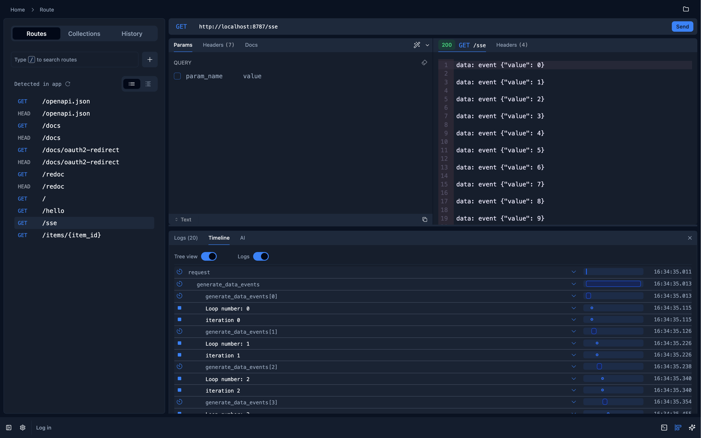

# Fiberplane with Python (alpha)

Fiberplane Studio is an API debugger for local developement. This is a work in progress on supporting Python applications with Fiberplane instrumentation and debugging. This directory includes the `fpxpy` package which supports FastAPI instrumentation and a few examples to quickstart.



## `fpxpy`

Provides instrumentation and route detection for [FastAPI](https://github.com/fastapi/fastapi) apps.

The package is available on PyPI, installing it as simple as

``` sh
uv add fpxpy
```

After installing `fpxpy` either from source or from `pip`, simply add the second line
referencing your `FastAPI` app.

```python
from fpxpy import setup

app = FastAPI()
setup(app)
```

After that, when running your FastAPI server, be sure to set the `FPX_ENDPOINT` env variable
pointing to your instance of Fiberplane Studio, e.g:

``` sh
FPX_ENDPOINT=http://localhost:8788/v1/traces uv run fastapi dev main.py
```

If you don't specify this environment variable, the library will not be enabled.

## API

The package exports two functions:

* [`setup`](#setup) which is used for adding middleware to the FastAPI app
* [`measure`](#measure) which is used for creating spans each time a function is called. Typically used as a decorator.

### `setup`

 Function

Initializes FPX instrumentation for a FastAPI application by configuring route detection and span instrumentation.

#### Parameters

* **app** (`FastAPI`): The FastAPI application instance that was instrumented

#### Returns

* `FastAPI`: The instrumented application instance

#### Environment Variables

* `FPX_ENDPOINT`: Required. The endpoint URL for FPX instrumentation

#### Example Usage

```python
from fastapi import FastAPI
from fpxpy import setup

app = FastAPI()
setup(app)
```

## Behavior

1. Checks for `FPX_ENDPOINT` environment variable
2. If not set:
   * Prints warning message
   * Returns unmodified app
3. If set:
   * Installs route detection
   * Configures span instrumentation with parsed URL
   * Returns instrumented app

## Notes

* Must be called after FastAPI app creation

* Requires `FPX_ENDPOINT` environment variable
* Modifies app in-place by adding middleware and route handlers

### `Measure`

A decorator that wraps functions with OpenTelemetry span instrumentation to measure execution time and track errors.

#### Usage

Basic Usage:

```python
from fpxpy import measure
from opentelemetry.trace import SpanKind

@measure()
def my_function():
    return "Hello World"

@measure("custom-name")
def named_function():
    return "Hello Named World"
```

With Custom Span Configuration:

```python
@measure(
    name="db-query",
    span_kind=SpanKind.CLIENT,
    attributes={"db.system": "postgresql"}
)
async def query_database():
    # ... database code
    pass
```

With Callbacks:

```python
def on_start_cb(span, *args, **kwargs):
    span.set_attribute("custom.start", "started")

@measure(
    name="monitored-function",
    on_start=on_start_cb,
    on_success=lambda span, result: span.set_attribute("result.value", str(result)),
    on_error=lambda span, exc: span.set_attribute("error.message", str(exc))
)
def monitored_function():
    pass
```

#### Parameters

* **name** (`Optional[str]`): Name of the span. Defaults to the function name if not provided.
* **func** (`Optional[Callable]`): Function to wrap. Used internally by the decorator.
* **span_kind** (`SpanKind`): Kind of span to create. Defaults to `SpanKind.INTERNAL`
* **on_start** (`Optional[Callable]`): Callback executed when span starts. Receives span and function arguments.
* **on_success**(`Optional[Callable]`): Callback executed on successful completion. Receives span and function result.
* **on_error** (`Optional[Callable]`): Callback executed on error. Receives span and exception.
* **check_result** (`Optional[Callable]`): Optional validation function for the result.
* **attributes** (`Optional[Dict]`): Initial attributes to set on the span.

#### Returns

Returns a wrapped function that:

* Creates a new span when called
* Executes the original function
* Records success/failure in the span
* Supports both sync and async functions

#### Notes

* Automatically handles both synchronous and asynchronous functions
* Preserves function signatures and docstrings
* Supports direct function decoration and configuration via parameters
* Integrates with OpenTelemetry context propagation
* Thread-safe and context-manager compatible

#### Examples

Track Database Queries:

```python
@measure(
    name="db-query",
    span_kind=SpanKind.CLIENT,
    attributes={"db.system": "postgresql"}
)
async def get_user(user_id: str):
    # ... database code
    pass
```

Monitor HTTP Requests

```python
@measure(
    name="http-request",
    span_kind=SpanKind.CLIENT,
    attributes={"http.method": "GET"}
)
async def fetch_data(url: str):
    # ... http request code
    pass
```

Track Function Performance

```python
@measure(
    name="expensive-calculation",
    attributes={"calculation.type": "matrix-multiply"}
)
def matrix_multiply(a: np.ndarray, b: np.ndarray):
    # ... calculation code
    pass
```

### Example application

We also have an example application that can be found under [/examples/python-fastapi](https://github.com/fiberplane/fpx/tree/main/examples/python-fastapi)

### Development

This package uses uv for its dependencies and running the tooling. The following tools are used for linting, checking & formatting. They are listed as part of the dev dependencies (and will be installed by uv by default).

* [MyPy](https://www.mypy-lang.org/) for type checking. Run: `uv run mypy .`
* [ruff](https://docs.astral.sh/ruff/formatter/) for linting (`uv run ruff check`) and formatting (`uv run ruff format`)
