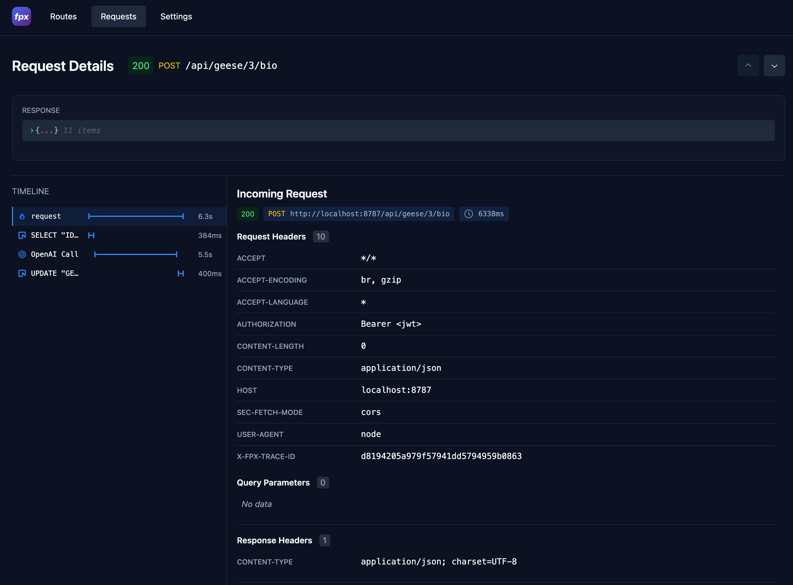
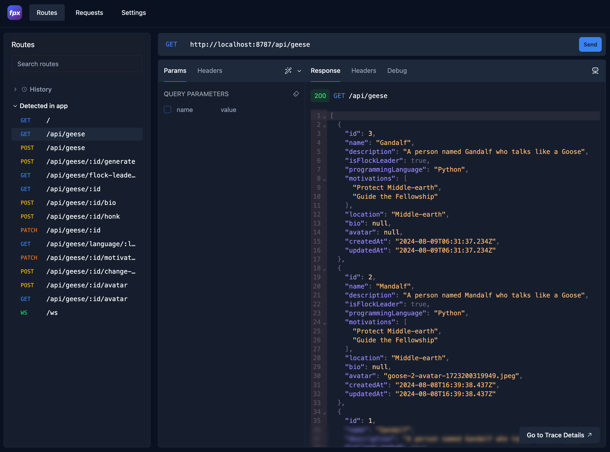

import { Card, CardGrid, Steps } from '@astrojs/starlight/components';


<div className="grid gap-4 lg:grid-cols-2 lg:gap-4">
  <div className="w-full p-2 flex justify-center md:p-4  lg:hidden">
    <div className="rounded overflow-hidden">
      
    </div>
  </div>

  <div className="w-full">
  ## Quickstart
    <Steps>
    1. Create your Hono API

        ```sh
        npm create hono@latest my-api
        ```

    2. Add `@fiberplane/hono-otel` with two lines of code
        ```ts {"1. Import the instrument function":2-3} {"2. Wrap your application":11-12}
        import { Hono } from 'hono';

        import { instrument } from '@fiberplane/hono-otel';

        const app = new Hono();

        app.get('/', (c) => c.text('Hello, world!'));

        // ... define your routes


        export default instrument(app);
        ```
    3. Launch FPX in your API directory
        ```sh
        npx @fiberplane/studio@latest
        ```
    </Steps>
  </div>

  <div className="w-full flex flex-col justify-content items-center py-12 px-6 max-lg:hidden sticky">
    <div className="translate-y-[70%] translate-z-2 shadow-lg">
      
    </div>
    <div className="-translate-y-[80%] translate-x-[15%] translate-z-0 shadow-lg">
      
    </div>
  </div>
</div>


